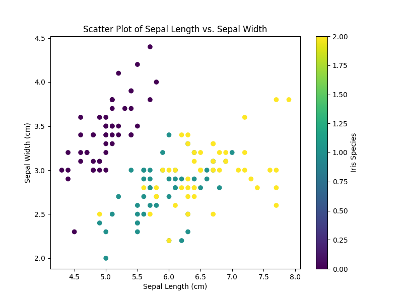

# Template for Python projects 

## IDS-706 2023 fall Week 2 Mini-project_Pandas_Script
Requirements
- Python script using Polars for descriptive statistics
- Read a dataset (CSV or Excel)
- Generate summary statistics (mean, median, standard deviation)
- Create at least one data visualization

# Target
Analyze the iris features and summary them in both form and plots, using Polars (the latest version) instead of Pandas!

# Dataset
Iris dataset from sklearn

# CI/CD
- Including `make install`, `make lint`, `make test`, `make format` and `make deploy`
- `make lint` uses pylint with configuration in `.pylintrc`
- Unit test cover 100%

# Result screenshot

## CI/CD process

## Summary statistics 

## Data Visualization

### Scatter plot

### Box plot

### Histogram plot

